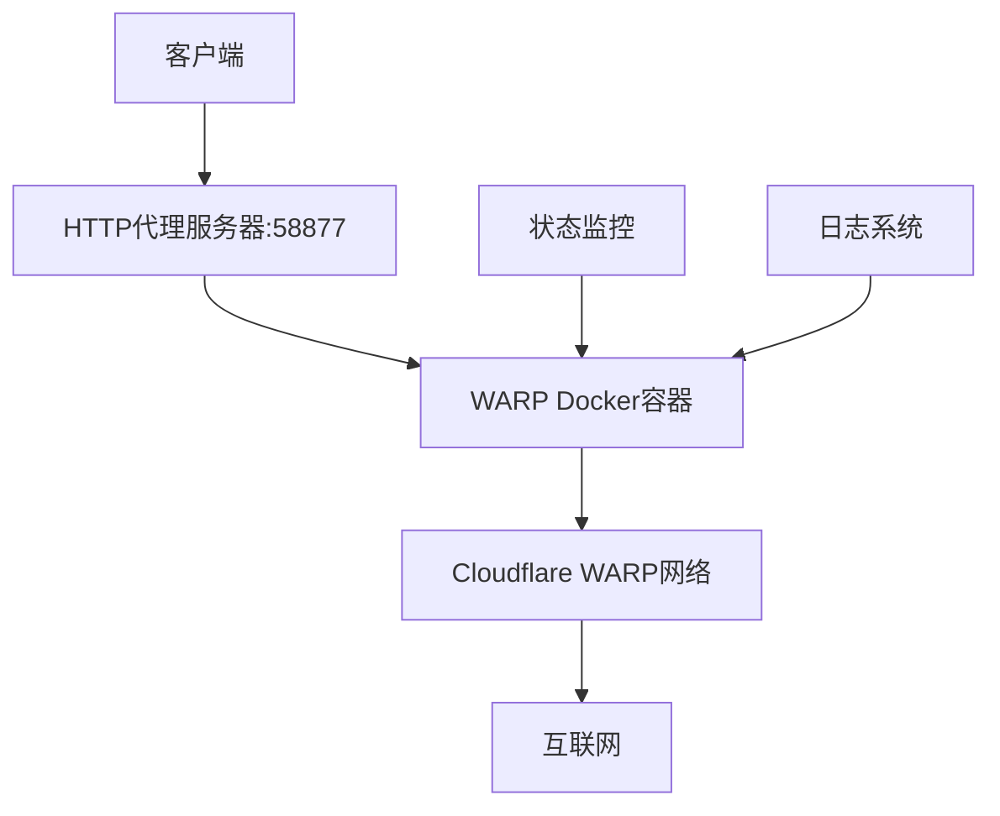

# WARP Docker

一个基于 Docker 的 Cloudflare WARP 客户端实现，提供安全的 zero trust 连接和 HTTP 代理服务。

## 项目概述

本项目提供了一个完整的 Docker 化解决方案，用于运行 Cloudflare WARP 客户端。它包含两个主要服务：

1. **HTTP 代理服务器** - 提供 HTTP/HTTPS 代理服务
2. **WARP Docker** - Cloudflare WARP zero trust 客户端

## 功能特性

- 🌐 **全球网络访问** - 通过 Cloudflare WARP 实现安全的全球网络访问
- 🔒 **安全连接** - 使用 MASQUE 协议（替代 WireGuard）避免 QoS 限制
- 📊 **实时监控** - 提供详细的 WARP 连接状态和日志监控
- 🐳 **容器化部署** - 完全基于 Docker，便于部署和管理
- 🔄 **自动重连** - 自动处理 WARP 连接中断和重连
- 📝 **详细日志** - 完整的日志记录系统，便于故障排查

## 系统要求

- Docker >= 20.10
- Docker Compose >= 1.29
- Linux 系统（支持 TUN 设备）
- 网络权限（NET_ADMIN capability）

## 快速开始

### 使用 Docker Compose（推荐）

1. 克隆项目：

```bash
git clone <repository-url>
cd warp-docker
```

2. 修改配置（如需要）：

   - 编辑 `docker-compose.yml` 中的密码和其他配置

3. 启动服务：

```bash
docker-compose up -d
```

4. 查看状态：

```bash
docker-compose logs -f warp-docker
```

### 使用 Docker 直接运行

```bash
docker run \
    --cap-add NET_ADMIN \
    --sysctl net.ipv4.conf.all.src_valid_mark=1 \
    --device /dev/net/tun:/dev/net/tun \
    -it docker.cnb.cool/masx200/docker_mirror/warp-docker:latest
```

## 配置说明

### HTTP 代理服务器配置

- **端口**: 58877
- **用户名**: admin
- **密码**: 需要在 `docker-compose.yml` 中设置
- **DoH 服务器**: https://doh-server.masx200.ddns-ip.net
- **支持协议**: HTTP/HTTPS, h2, h3

### WARP 客户端配置

- **协议**: MASQUE（自动设置，避免 WireGuard QoS 限制）
- **模式**: warp+doh（WARP + DNS over HTTPS）
- **自动注册**: 每次启动自动注册新设备
- **状态监控**: 实时显示连接状态和日志

## 文件结构

```
warp-docker/
├── README.md              # 项目文档
├── docker-compose.yml     # Docker Compose配置
├── dockerfile            # Docker镜像构建文件
├── entrypoint.sh         # 容器启动脚本
├── status.sh             # 状态监控脚本
├── build.sh              # 构建脚本
├── debian.sources        # Debian软件源配置
├── debian.sources-http   # HTTP软件源配置
├── sources.list          # APT源列表
├── sources.list-http     # HTTP APT源列表
└── .github/workflows/    # CI/CD配置
```

## 架构说明

### 网络架构



### 服务组件

1. **HTTP 代理服务器**

   - 基于 Go 语言开发
   - 支持 HTTP/HTTPS 代理
   - 集成 DoH（DNS over HTTPS）
   - 支持 h2 和 h3 协议

2. **WARP Docker 容器**
   - 基于 Debian stable-slim
   - 集成 Cloudflare WARP 客户端
   - 自动配置 TUN 设备
   - 集成 DBus 服务
   - 完整的日志系统

## 构建镜像

### 使用构建脚本

```bash
# 给构建脚本执行权限
chmod +x build.sh

# 执行构建
./build.sh
```

### 手动构建

```bash
docker build -f dockerfile -t "docker.cnb.cool/masx200/docker_mirror/warp-docker:latest" .
```

## 使用说明

### 基本使用

1. **启动服务**：

```bash
docker-compose up -d
```

2. **查看日志**：

```bash
# 查看所有服务日志
docker-compose logs -f

# 查看特定服务日志
docker-compose logs -f warp-docker
docker-compose logs -f http-proxy-go-server
```

3. **停止服务**：

```bash
docker-compose down
```

### 代理配置

HTTP 代理服务器地址：`http://admin:<password>@localhost:58877`

#### 系统代理设置

**Linux/macOS**:

```bash
export http_proxy="http://admin:<password>@localhost:58877"
export https_proxy="http://admin:<password>@localhost:58877"
```

**Windows (PowerShell)**:

```powershell
$env:http_proxy="http://admin:<password>@localhost:58877"
$env:https_proxy="http://admin:<password>@localhost:58877"
```

#### 浏览器代理设置

在浏览器网络设置中配置代理服务器：

- 地址：localhost
- 端口：58877
- 用户名：admin
- 密码：设置的密码

### WARP 状态监控

容器启动后会自动运行状态监控脚本，显示：

- WARP 连接状态
- 实时日志输出
- 网络连接信息
- 错误诊断信息

## 故障排除

### 常见问题

1. **TUN 设备创建失败**

   ```bash
   # 检查TUN设备权限
   ls -la /dev/net/tun

   # 如果不存在，手动创建
   sudo mkdir -p /dev/net
   sudo mknod /dev/net/tun c 10 200
   sudo chmod 600 /dev/net/tun
   ```

2. **WARP 连接失败**

   ```bash
   # 查看详细日志
   docker-compose logs warp-docker

   # 检查网络连接
   docker exec -it warp-docker ping 1.1.1.1
   ```

3. **代理服务器无法连接**

   ```bash
   # 检查端口是否占用
   netstat -tulpn | grep 58877

   # 查看代理服务器日志
   docker-compose logs http-proxy-go-server
   ```

### 日志文件位置

容器内的日志文件：

- `/var/log/warp/cli.log` - WARP CLI 日志
- `/var/log/warp/cli-err.log` - WARP CLI 错误日志
- `/var/log/warp/svc.log` - WARP 服务日志
- `/var/log/warp/svc-err.log` - WARP 服务错误日志

### 调试模式

启用详细日志输出：

```bash
# 在docker-compose.yml中修改entrypoint
entrypoint: ["bash", "-x", "/entrypoint.sh", "/status.sh"]
```

## 安全注意事项

- 🔐 **密码安全**：请修改默认密码
- 🔒 **网络安全**：建议在受信任的网络环境中使用
- 🛡️ **权限控制**：容器需要 NET_ADMIN 权限，请确保安全性
- 📝 **日志管理**：定期清理日志文件，避免磁盘空间不足

## 许可证

本项目基于 [ethanscully/warp-docker](https://github.com/ethanscully/warp-docker) 项目，遵循相应的开源许可证。

## 贡献

欢迎提交 Issue 和 Pull Request 来改进项目。

## 更新日志

### v1.0.0

- 初始版本发布
- 支持 MASQUE 协议
- 集成 HTTP 代理服务器
- 完整的监控系统
- Docker Compose 支持

## 联系方式

如有问题或建议，请通过以下方式联系：

- 提交 GitHub Issue
- 发送邮件至项目维护者

---

**注意**：本项目仅用于合法的网络访问和测试目的，请遵守当地法律法规。
